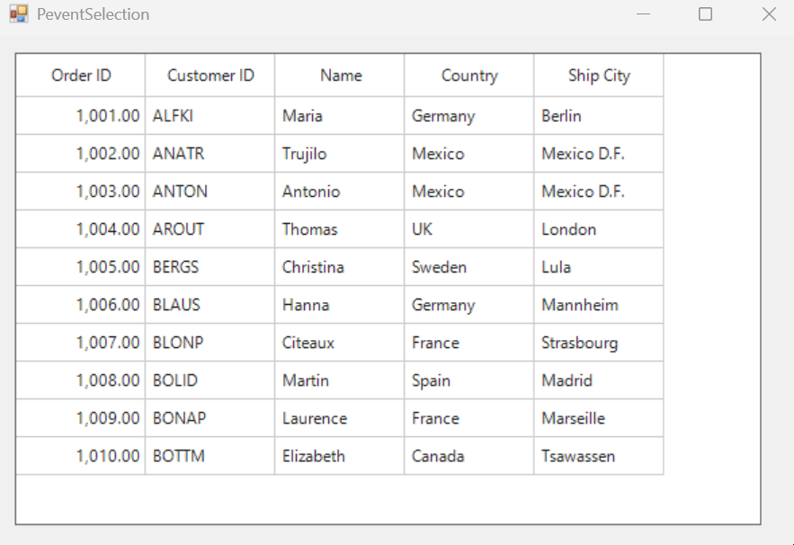

# How to prevent the user from selecting more than a specific number of rows in a WinForms DataGrid?

In [WinForms DataGrid](https://www.syncfusion.com/winforms-ui-controls/datagrid) (SfDataGrid), limiting selection to a maximum of two can be achieved by handling the [SelectionChanging](https://help.syncfusion.com/cr/windowsforms/Syncfusion.WinForms.DataGrid.SfDataGrid.html#Syncfusion_WinForms_DataGrid_SfDataGrid_SelectionChanging) event. Within this event, logic can be applied to evaluate the counts of [SelectedItems](https://help.syncfusion.com/cr/windowsforms/Syncfusion.WinForms.DataGrid.SfDataGrid.html#Syncfusion_WinForms_DataGrid_SfDataGrid_SelectedItems), **RemovedItems**, and **AddedItems**. If the total number of selected rows exceeds two, the selection process can be cancelled by setting  **e.cancel** to **true**.

```csharp
private void OnSelectionChanging(object sender, SelectionChangingEventArgs e)
{
     var dataGrid = (sender as SfDataGrid);
     if (dataGrid != null && (dataGrid.SelectedItems.Count + e.AddedItems.Count - e.RemovedItems.Count > 2))
     {
         // Cancel the selection above 2 rows
         e.Cancel = true;
     }
}
```



Take a moment to peruse the [WinForms DataGrid - Selection](https://help.syncfusion.com/windowsforms/datagrid/selection) documentation, to learn more about selection with examples.